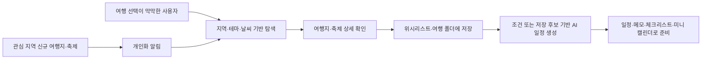
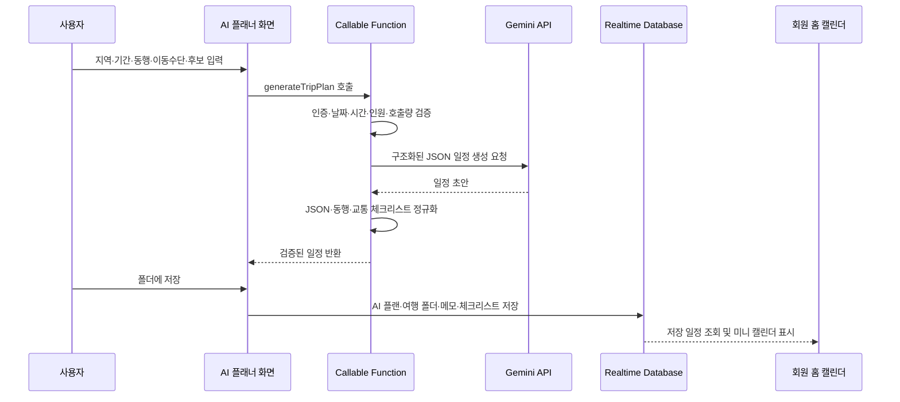
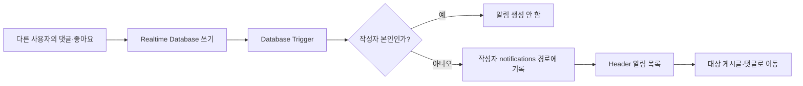
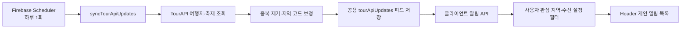
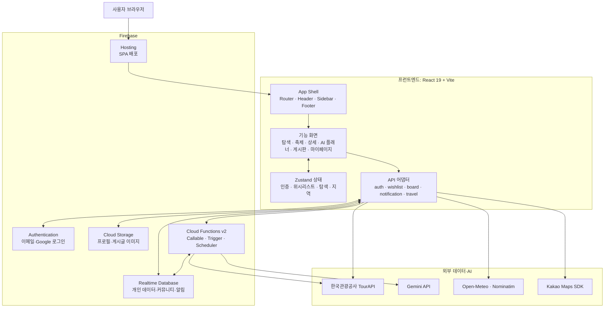
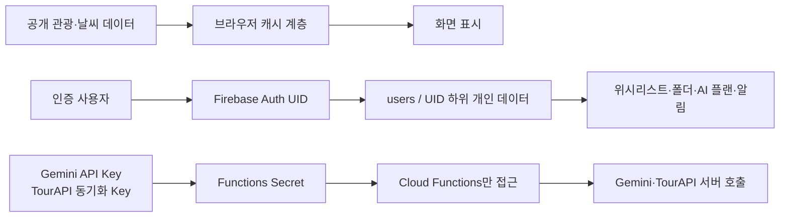

# 기술 아키텍처

> 이 문서는 공모전 심사자가 CodeTrip의 서비스 흐름, 데이터 처리 방식, 보안 경계를 짧은 시간 안에 이해할 수 있도록 정리한 현재 구현 기준의 아키텍처 설명서입니다.

## 1. 서비스가 해결하는 흐름

CodeTrip은 여행지를 단순히 나열하는 서비스가 아니라, 사용자가 **탐색 → 비교·저장 → 일정 생성 → 다시 탐색**으로 이어지는 여행 의사결정 과정을 관리하도록 돕습니다.

### 심사 시 보여줄 핵심 가치

| 단계 | 사용자 문제 | CodeTrip의 처리 |
| --- | --- | --- |
| 탐색 | 어디서부터 찾아야 할지 모름 | TourAPI 관광·축제 데이터, 지역·테마·키워드·날씨 단서를 제공 |
| 비교·저장 | 찾은 후보가 흩어지고 다시 찾기 어려움 | 위시리스트, 폴더, 메모, 체크리스트로 후보를 개인 공간에 축적 |
| 계획 | 저장한 후보를 실제 일정으로 바꾸기 어려움 | 조건 또는 폴더 후보를 Gemini 기반 AI 플래너로 구조화된 일정 초안 생성 |
| 재방문 | 관심 지역의 변화 정보를 놓침 | 신규 여행지·축제를 정기 수집하고 관심 지역 기준으로 Header 알림에 표시 |
| 커뮤니티 | 게시글 반응을 놓침 | 댓글·좋아요 이벤트를 작성자 개인 알림으로 비동기 기록 |

## 2. 대표 비즈니스 흐름

### 2.1 AI 여행 계획 생성·저장

AI 계획은 공공 관광 데이터에 연결되는 저장 후보와 AI가 보완 제안한 장소를 구분합니다. 서버는 날짜의 실제 존재 여부, 종료 시간, 동행 인원, 요청 크기와 호출량을 검증하므로 화면 검증만 우회해도 잘못된 요청이 저장되지 않습니다.

### 2.2 커뮤니티 반응 알림

댓글·게시글 좋아요·댓글 좋아요 알림은 이벤트 식별자를 고정해 Functions 재시도에도 같은 알림이 중복 생성되지 않도록 설계했습니다.

### 2.3 관심 지역 신규 정보 알림

신규 데이터는 서버 함수만 공용 피드에 기록하고, 클라이언트는 로그인 사용자에게 읽기만 제공합니다. 사용자의 읽음·숨김 상태는 개인 경로에서 별도로 관리합니다.

## 3. 시스템 구조

### 레이어별 책임

| 레이어 | 주요 위치 | 책임 |
| --- | --- | --- |
| 화면·경험 | `src/pages`, `src/components`, `src/App.jsx` | 라우팅, 입력, 로딩·오류 상태, 반응형 UI, 사용자 흐름 연결 |
| 상태 | `src/store` | 인증 세션, 위시리스트·폴더·AI 플랜, 탐색 조건 등 화면 간 공유 상태 |
| 데이터 접근 | `src/api` | Firebase 및 외부 API 호출, 응답 정규화, 캐시, 화면과 인프라의 결합 최소화 |
| 서버 검증·자동화 | `functions/index.js` | AI 요청 검증·비밀키 사용, 게시판 반응 알림, TourAPI 정기 수집 |
| 데이터·보안 | `database.rules.json`, `storage.rules` | 사용자 UID 기반 접근 제어, 이미지 업로드 경로·형식 제한 |
| 배포 | `firebase.json` | Hosting SPA rewrite, Functions Node.js 22, Rules 배포 대상 정의 |

## 4. 데이터와 보안 경계

- 개인 데이터는 `users/{uid}` 하위에 두고 Realtime Database Rules가 `auth.uid` 기준으로 접근을 제한합니다.
- 좋아요는 콘텐츠 본문과 분리된 `likes/{type}/{id}/{uid}` 경로에서 사용자가 자신의 UID 키만 변경합니다.
- 프로필·게시글 이미지는 Cloud Storage에 저장하고, Realtime Database에는 다운로드 URL만 기록합니다.
- Gemini API 키와 TourAPI 정기 수집 키는 브라우저 환경변수가 아닌 Functions Secret으로 관리합니다.
- 외부 데이터는 메모리·localStorage·Realtime Database 캐시를 조합해 반복 호출과 응답 지연을 줄이며, 유효한 stale 캐시를 실패 시 fallback으로 활용합니다.

세부 데이터 모델과 Rules는 [데이터·보안](05-data-security.md), AI 입력·출력 계약은 [Gemini API 하네스 엔지니어링](10-ai-harness-engineering.md)에서 확인합니다.

## 5. 운영·신뢰성 설계

| 항목 | 현재 적용 방식 |
| --- | --- |
| AI 요청 보호 | 로그인 사용자만 Callable Function 호출, 사용자별 요청량·동시 요청 수 제한, 60초 함수 제한 |
| AI 응답 안정화 | timeout·재시도, JSON 파싱, 구조 검증, 동행·교통 체크리스트 정규화 |
| TourAPI 동기화 | 재시도·timeout, 응답 코드·구조 검증, 중복 제거, 최근 항목 보존 수 제한 |
| 알림 안정성 | Trigger 재시도에도 중복되지 않는 알림 ID, 본인 반응 제외 |
| 배포 검증 | lint·build·Rules 테스트와 핵심 사용자 흐름 smoke test |

## 6. 현재 범위와 향후 고도화

현재 서비스는 Firebase 기반 서버리스 구조로 인증·개인 데이터·커뮤니티·AI 보안 경계·정기 데이터 동기화를 운영합니다. 다만 여행지 탐색·날씨·지도 데이터 일부는 브라우저에서 외부 API를 직접 조회하므로, 장기적으로는 외부 API 프록시화, 캐시 관측성, 라우트 단위 코드 스플리팅을 고도화 과제로 관리합니다.

이 경계는 현재 구현을 과장하지 않고, 공모전 MVP에서 검증한 기능과 이후 확장 방향을 구분하기 위한 것입니다.

## 7. 번들 구조와 코드 스플리팅 계획

현재 라우팅은 `src/main.jsx`에서 페이지 컴포넌트를 정적 import합니다. Vite 빌드의 500kB 초과 청크 경고를 개선하기 위해 `AiPlanner`, `Board`, `BoardWrite`, `BoardDetail`, `MyPage`, `Settings`, `TravelDetail`, `Festivals`를 우선 대상으로 `React.lazy`와 `Suspense` 기반 라우트 단위 코드 스플리팅을 검토합니다.

적용 전후에는 `npm run build` 결과의 청크 크기를 비교하고, 필요 시 Firebase·React·지도·Markdown 의존성의 `manualChunks` 분리를 검토합니다. 이 항목은 현재 계획 단계이며, 완료 여부는 빌드 로그와 [캐시 측정표](38-cache-measurement-sheet.md)로 증빙합니다.
